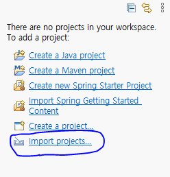
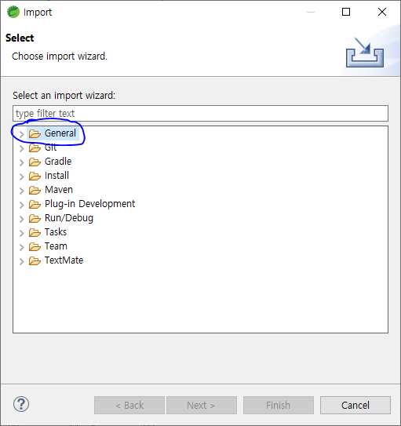
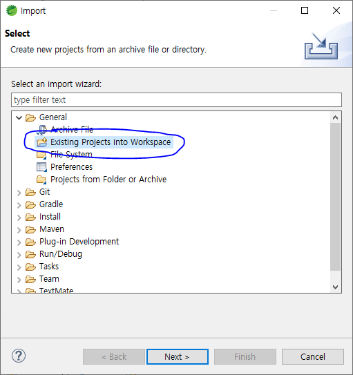
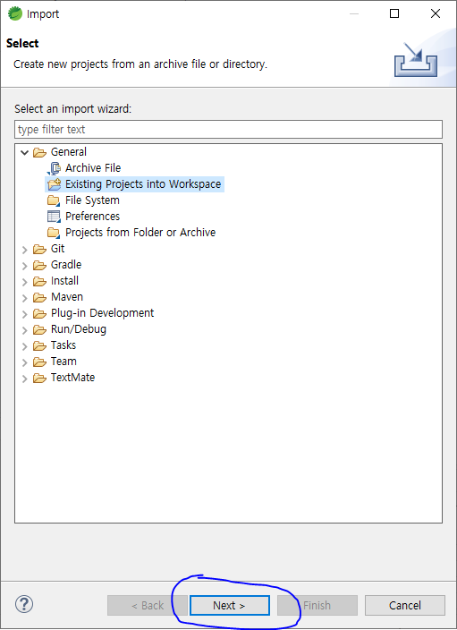
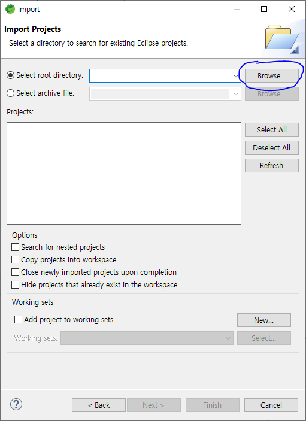
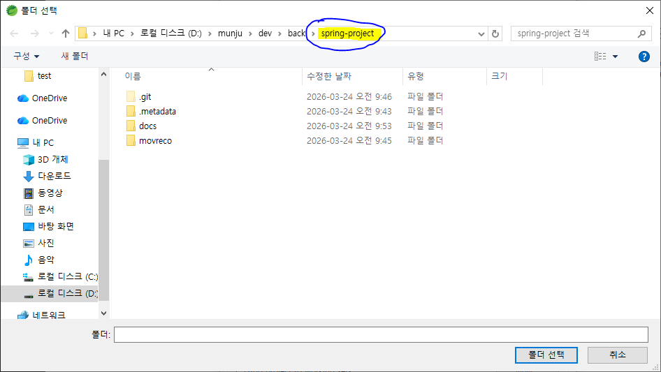
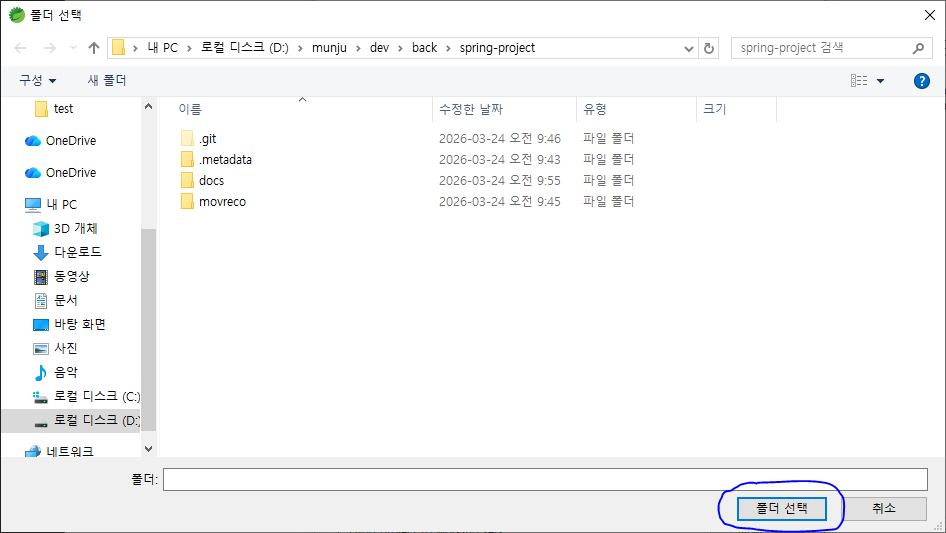
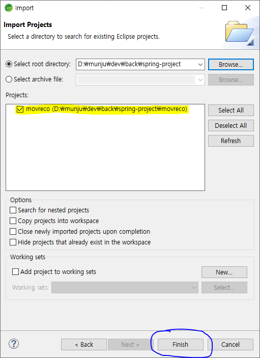

# spring-project

## 개발 환경

| 항목        | 버전         |
| ----------- | ------------ |
| STS         | 4.32.0       |
| JDK         | 21           |
| Spring Boot | 3.5.11       |
| Gradle      | Wrapper 포함 |
| DB          | MySQL        |

---

## 프로젝트 불러오기 (git clone 후)

> git clone 후 STS에서 프로젝트를 처음 불러올 때, 아래 과정을 **1회만** 수행하면 됩니다.

### 1단계. `Import projects...` 클릭

STS를 열면 좌측 프로젝트 목록이 비어있습니다. **Import projects...** 를 클릭합니다.



### 2단계. `General` 선택

Import 창에서 **General** 폴더를 선택합니다.



### 3단계. `Existing Projects into Workspace` 선택

General 하위의 **Existing Projects into Workspace** 를 선택합니다.



### 4단계. `Next >` 클릭

선택 후 **Next >** 버튼을 클릭합니다.



### 5단계. `Browse...` 클릭

Select root directory 옆의 **Browse...** 버튼을 클릭합니다.



### 6단계. `spring-project` 폴더로 이동

Clone 받은 **spring-project** 폴더로 이동합니다.



### 7단계. `폴더 선택` 클릭

spring-project 폴더가 맞는지 확인하고 **폴더 선택** 버튼을 클릭합니다.



### 8단계. `movreco` 체크 후 `Finish`

Projects 목록에 **movreco** 프로젝트가 자동으로 검색됩니다. 체크된 상태에서 **Finish** 를 클릭하면 완료됩니다.



---

이후 STS를 닫았다가 다시 열어도 프로젝트가 정상적으로 표시됩니다.

---

## DB 설정

`application-local.properties` 파일은 Git에 올라가지 않으므로, 각자 로컬에서 직접 생성해야 합니다.

### 파일 생성 위치

```
movreco/src/main/resources/application-local.properties
```

### 파일 내용

```properties
spring.datasource.url=jdbc:mysql://localhost:3306/movreco?useSSL=false&allowPublicKeyRetrieval=true&serverTimezone=UTC&createDatabaseIfNotExist=true
spring.datasource.username=본인_DB_아이디
spring.datasource.password=본인_DB_비밀번호
```

> 이 파일을 생성하지 않으면 기본값(`root` / `1234`)으로 접속합니다.
